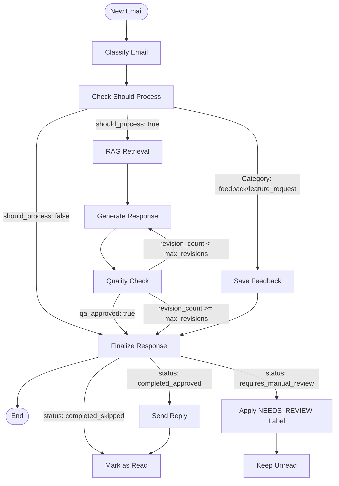

# TaskFlow Pro - AI Customer Support Automation

A production-ready multi-agent system for automating customer support email responses using LangGraph and RAG (Retrieval-Augmented Generation).

## Overview

This system automatically processes customer support emails through a sophisticated multi-agent workflow. It categorizes inquiries, retrieves relevant information from product documentation, generates personalized responses, and ensures quality before sending.

The system supports both local execution using HuggingFace Transformers and cloud-based inference via Groq API for faster processing.

## Features

- **Intelligent Classification** - Automatically categorizes emails into technical support, billing, product inquiries, feature requests, and feedback with priority assignment
- **RAG-Powered Responses** - Retrieves accurate information from product documentation to answer questions
- **Multi-Agent Workflow** - Four specialized agents work together: Classifier, RAG Agent, Response Generator, and QA Agent
- **Quality Assurance** - Built-in review system with automatic revision loop for sub-par responses
- **Email Threading** - Replies are properly threaded in Gmail conversations
- **Manual Review Segregation** - Emails requiring review are automatically labeled and kept unread
- **Feedback Logging** - Automatically extracts and logs feedback/feature requests with LLM-based extraction
- **Standardized Responses** - Professional, consistent email format across all categories
- **Flexible Deployment** - Supports local execution or cloud-based inference
- **Optimized Performance** - Includes INT8 quantization, parallel processing, and smart caching
- **Response Caching** - Similar emails are answered instantly from cache

## LangGraph Workflow

The system uses LangGraph to orchestrate a stateful workflow with conditional routing:



### Workflow Nodes

1. **Classify** - Email classification agent categorizes and assigns priority
2. **Check Should Process** - Determines if email should be processed, saved as feedback, or skipped
3. **Retrieve Context** - RAG agent retrieves relevant documentation (parallel processing enabled)
4. **Generate Response** - Response generator creates category-specific, formatted responses
5. **Quality Check** - QA agent reviews response quality (score 0-10)
6. **Save Feedback** - Extracts and logs feedback/feature requests with LLM
7. **Finalize** - Determines final status and routes to appropriate action

### Conditional Routing

**After Classification:**
- `feedback` or `feature_request` → Save to feedback log, send acknowledgment
- `should_process: true` → Continue to RAG retrieval
- `should_process: false` → Skip (unrelated emails)

**After QA:**
- `qa_approved: true` → Finalize and send
- `revision_count < max_revisions` → Revise (loop back to Generate)
- `revision_count >= max_revisions` → Finalize as requires_manual_review

## Architecture

The system uses LangGraph to orchestrate four AI agents:

1. **Email Classifier** - Categorizes incoming emails and assigns priority levels
2. **RAG Agent** - Searches product documentation and synthesizes relevant context
3. **Response Generator** - Drafts personalized email responses using category-specific templates
4. **QA Agent** - Reviews responses for quality, accuracy, and tone before sending

Each email flows through this pipeline with conditional routing based on classification and quality scores. Failed QA checks trigger automatic revision up to a configurable limit.

## Technology Stack

- **LangGraph** - Multi-agent workflow orchestration
- **LangChain** - AI framework and RAG implementation
- **HuggingFace Transformers** - Local LLMs (unlimited, private)
- **Groq API** - Fast cloud-based LLM inference (optional, 14.4k requests/day free tier)
- **Sentence Transformers** - Local embeddings
- **ChromaDB** - Vector database for document storage
- **Gmail API** - Email operations and threading
- **Python 3.9+** - Core runtime

## Recent Updates & Optimizations

### Email Management
- **Email Threading** - Replies are properly threaded in Gmail using `In-Reply-To` and `References` headers
- **Label Management** - Emails requiring manual review are automatically labeled with `NEEDS_REVIEW` and kept unread
- **Proper Formatting** - All emails formatted with consistent spacing, no tabs, and properly aligned signatures

### Feedback Handling
- **LLM-Based Extraction** - Feedback and feature requests are extracted using LLM to capture only relevant content
- **Structured Logging** - Feedback saved to `feedback_logs/` in format: `Name | Date | Concise Feedback`
- **Automatic Acknowledgments** - Professional acknowledgment emails sent for feedback and feature requests

### Performance Optimizations
- **INT8 Quantization** - 2-3x speedup on GPU (auto-enabled)
- **Parallel Processing** - RAG retrieval runs concurrently for subject and body
- **Response Caching** - Exact and fuzzy matching caches similar responses
- **Token Optimization** - Agents use optimized token limits per task
- **Prompt Optimization** - Concise, focused prompts for faster inference

### Response Quality
- **Standardized Format** - All responses follow consistent structure:
  - Professional salutation
  - Context-appropriate acknowledgment
  - Main content
  - Closing: "Hope you have a great day!"
  - Signature: TaskFlow Pro Team
- **Quality Scoring** - Responses scored 0-10 with automatic approval at 8.0+
- **Revision Loop** - Failed responses automatically revised (configurable max attempts)

### Deployment
- **Colab Support** - Improved OAuth handling for Google Colab environment
- **Error Handling** - Comprehensive error messages with troubleshooting guidance
- **Flexible Configuration** - Easy switching between HuggingFace and Groq providers

## Installation

### Prerequisites

- Python 3.9 or higher
- 8GB RAM minimum (16GB recommended)
- 5GB free disk space

### Step 1: Clone Repository

```bash
git clone <repository-url>
cd ProductSupportAgents
```

### Step 2: Install Python Dependencies

```bash
pip install -r requirements.txt
```

### Step 3: Set Environment Variables

Create a `.env` file in the project root:

```bash
# LLM Provider: "groq" or "huggingface"
LLM_PROVIDER=huggingface

# HuggingFace Configuration
LLM_MODEL=meta-llama/Llama-3.2-1B-Instruct
HF_TOKEN=your_token_here
USE_GPU=auto  # auto, true, false

# Groq Configuration (optional, faster)
GROQ_MODEL=llama-3.1-8b-instant
GROQ_API_KEY=your_key_here

# Email settings
GMAIL_EMAIL=support@taskflowpro.com
```

**HuggingFace Token (for gated models):**
1. Get token at [huggingface.co/settings/tokens](https://huggingface.co/settings/tokens)
2. Accept model license at the model's HuggingFace page
3. Add `HF_TOKEN=your_token_here` to `.env`

**Groq API Key (optional):**
1. Get free API key: [console.groq.com/keys](https://console.groq.com/keys)
2. Add `GROQ_API_KEY=your_key_here` and `LLM_PROVIDER=groq` to `.env`

### Step 4: Initialize Vector Store

This creates embeddings from the product documentation:

```bash
python setup_vectorstore.py
```

First run will download the embedding model (~90MB). Subsequent runs use cached model.

## Quick Start

### Local Machine with Mock Emails

```bash
python main.py --mode batch --mock-emails
```

### Continuous Monitoring (Real Gmail)

```bash
python main.py --mode continuous
```

### Using Groq API (Faster)

Set in `.env`:
```bash
LLM_PROVIDER=groq
GROQ_API_KEY=your_key_here
GROQ_MODEL=llama-3.1-8b-instant
```

Then run:
```bash
python main.py --mode batch --mock-emails
```

## Configuration

### Environment Variables


### Available Models

**HuggingFace Models:**
- `meta-llama/Llama-3.2-1B-Instruct` - 1B params, fast, good quality (default)
- `meta-llama/Llama-3.2-3B-Instruct` - 3B params, better quality
- `google/gemma-2-2b-it` - 2B params, alternative option
- `microsoft/phi-2` - 2.7B params, compact and efficient

**Groq Models:**
- `llama-3.1-8b-instant` - Fast, recommended default
- `llama-3.3-70b-versatile` - Higher quality
- `mixtral-8x7b-32768` - Excellent with 32k context

### Command Line Options

```bash
# Batch mode (process once and exit)
python main.py --mode batch --mock-emails

# Continuous monitoring
python main.py --mode continuous

# Adjust maximum revision attempts
python main.py --max-revisions 3 --mock-emails
```

## Project Structure

```
ProductSupportAgents/
├── agents/
│   ├── classifier.py          # Email classification agent
│   ├── rag_agent.py           # RAG retrieval agent
│   ├── response_generator.py  # Response drafting agent
│   └── qa_agent.py            # Quality assurance agent
├── workflows/
│   └── support_workflow.py    # LangGraph workflow orchestration
├── utils/
│   ├── config.py              # Configuration management
│   ├── email_handler.py       # Gmail API operations
│   ├── vector_store.py        # Vector database management
│   ├── llm_loader.py          # HuggingFace LLM loader
│   ├── groq_loader.py         # Groq API loader
│   ├── unified_llm_loader.py  # Unified LLM provider interface
│   ├── parallel_utils.py      # Parallel processing utilities
│   └── response_cache.py      # Response caching system
├── data/
│   ├── product_docs/          # Product documentation (markdown)
│   └── test_emails/           # Test email JSON files
├── feedback_logs/             # Feedback and feature request logs
├── main.py                    # Main execution script
├── setup_vectorstore.py       # Vector store initialization
└── requirements.txt           # Python dependencies
```

## How It Works

### Email Processing Flow

1. **Receive** - System monitors inbox for new emails (or uses mock emails for testing)
2. **Classify** - Email categorized into one of 6 categories with priority assignment
3. **Route** - Email routed based on category:
   - Feedback/Feature Request → Save to log, send acknowledgment
   - Processable → Continue to RAG retrieval
   - Unrelated → Skip
4. **Retrieve** - Relevant documentation fetched via RAG (parallel processing)
5. **Generate** - Personalized response drafted with standardized format
6. **Review** - Quality check with automatic revision loop (if needed)
7. **Finalize** - Response sent, feedback saved, or manual review triggered

### Supported Categories

| Category | Handling | Response |
|----------|----------|----------|
| **Technical Support** | Uses documentation if available, else escalates | Step-by-step instructions or escalation notice |
| **Product Inquiry** | Answers from documentation, else escalates | Product information or escalation notice |
| **Billing** | Always escalated (no database access) | Escalation notice only |
| **Feature Request** | Saved to log file | Acknowledgment email |
| **Feedback** | Saved to log file | Acknowledgment email |
| **Unrelated** | Skipped | No response |

### Response Format

All responses follow a standardized, professional format:

```
Hi [Name],

[Acknowledgment - apologize for issues or appreciate feedback]

[Main content - solution, information, or escalation notice]

Hope you have a great day!

Thanks,
TaskFlow Pro Team
support@taskflowpro.com
```

### Quality Assurance

Each response receives a quality score (0-10):

- **9.0-10.0** - Automatically approved (includes escalations)
- **8.0-8.9** - Automatically approved and sent
- **7.0-7.9** - Approved with minor notes
- **Below 7.0** - Triggers revision (up to `max_revisions`) or manual review

**Escalation Logic:**
- Escalation responses are automatically approved (score 9+) as they appropriately route to specialists
- Responses mentioning "need more information" or "escalate" are acceptable

### Feedback Logging

Feedback and feature requests are:
1. Extracted using LLM to get concise, relevant content
2. Saved to `feedback_logs/{category}_log.txt` in format: `Name | Date | Feedback`
3. Acknowledged with professional email response

### Manual Review System

Emails requiring manual review are:
1. Labeled with `NEEDS_REVIEW` in Gmail
2. Kept unread for visibility
3. Findable via Gmail search: `label:NEEDS_REVIEW is:unread`

## Performance

### Performance Metrics

| Configuration | Response Time | Throughput |
|---------------|---------------|------------|
| CPU (local) | 10-12s | ~300 emails/hour |
| GPU (local, INT8) | 3-6s | ~600-1200 emails/hour |
| Groq API | 1-2s | ~1800-3600 emails/hour |
| Cached responses | <1s | Instant |

### Optimizations Included

- **INT8 Quantization** - 2-3x faster on GPU (auto-enabled when GPU available)
- **Parallel Processing** - RAG retrieval runs concurrently for subject and body queries
- **Smart Caching** - Exact and fuzzy matching caches similar emails (instant responses)
- **Token Optimization** - Agents use optimized token limits per task:
  - Classifier: 128 tokens
  - RAG synthesis: 256 tokens
  - Response generator: 400 tokens
  - QA agent: 150 tokens
- **Prompt Optimization** - Concise, focused prompts for faster inference
- **Efficient Embeddings** - Lightweight `all-MiniLM-L6-v2` model (~90MB)

### Caching Strategy

The system implements intelligent response caching:

- **Exact Matching** - Identical emails answered instantly
- **Fuzzy Matching** - Similar emails (same category/subject) use cached responses
- **Quality Threshold** - Only cached responses with QA score >= 7.0
- **Automatic Cleanup** - Expired cache entries removed periodically

## Gmail Integration

### Setup

1. **Enable Gmail API:**
   - Go to [Google Cloud Console](https://console.cloud.google.com/apis/credentials)
   - Create a project (or use existing)
   - Enable Gmail API
   - Create OAuth 2.0 credentials (Desktop app type for Colab, Web app for local)

2. **Download Credentials:**
   - Download `credentials.json` to project root
   - For Colab: Use Desktop app client ID
   - For local: Web app client ID works

3. **Authenticate:**
   - Run the system - first run will prompt for OAuth authentication
   - Follow the instructions to authorize
   - Token saved to `token.pickle` for future use

4. **Test with Mock Emails:**
   ```bash
   python main.py --mode batch --mock-emails
   ```

5. **Use Real Gmail:**
   ```bash
   python main.py --mode continuous
   ```

### Features

- **Email Threading** - Replies properly threaded in Gmail conversations
- **Label Management** - Automatic labeling for emails requiring review
- **Read Status** - Emails requiring review stay unread
- **Error Handling** - Comprehensive error messages with troubleshooting

## Customization

### Add Product Documentation

1. Place markdown files in `data/product_docs/`
2. Rebuild vector store: `python setup_vectorstore.py`

### Modify Response Templates

Edit category-specific prompts in `agents/response_generator.py`:

- Technical support responses
- Product inquiry responses
- Billing escalation notices
- Feedback acknowledgments

### Adjust Email Categories

Update `EMAIL_CATEGORIES` dictionary in `utils/config.py`

### Change LLM Model

Update `.env` file with desired model name:

```bash
LLM_MODEL=meta-llama/Llama-3.2-3B-Instruct  # HuggingFace
GROQ_MODEL=llama-3.3-70b-versatile          # Groq
```

### Adjust Quality Thresholds

Modify QA agent approval logic in `agents/qa_agent.py`

## Testing

### Test Individual Components

```bash
# Test complete workflow with mock emails
python main.py --mode batch --mock-emails

# Validate configuration
python -c "from utils.config import validate_config; validate_config()"
```

### Test with Sample Emails

1. Create JSON files in `data/test_emails/`:
```json
{
  "sender": "customer@example.com",
  "subject": "How do I reset my password?",
  "body": "I forgot my password and need help resetting it."
}
```

2. Run with mock emails:
```bash
python main.py --mode batch --mock-emails
```

## Production Deployment

### Connecting Real Email

1. Enable Gmail API in Google Cloud Console
2. Download `credentials.json` to project root
3. Run system - first run will prompt for authentication
4. Remove `--mock-emails` flag from command

### Scaling Considerations

- Run on dedicated server with adequate RAM (16GB+ recommended)
- Use GPU for faster inference or Groq API for cloud speed
- Implement load balancing for high volume
- Add monitoring and alerting (Prometheus, Grafana)
- Set up log aggregation (ELK stack)
- Use Redis for distributed caching
- Consider cloud vector database (Pinecone, Weaviate) for multi-instance deployments

### Security

**With HuggingFace (Local):**
- All processing happens locally
- Customer emails never sent to external APIs
- LLM runs on your infrastructure
- Complete control over data
- GDPR/HIPAA compliant

**With Groq API:**
- Email content is sent to Groq's servers
- Review Groq's privacy policy for compliance requirements
- Consider data residency requirements

### Best Practices

- Rotate Gmail API tokens periodically
- Monitor response quality scores
- Review feedback logs regularly
- Keep product documentation updated
- Set appropriate `max_revisions` (2-3 recommended)
- Use caching for high-volume deployments
- Implement rate limiting for API calls

## System Requirements

### Minimum

- CPU: Any modern processor (4+ cores recommended)
- RAM: 8GB (16GB recommended)
- Storage: 5GB free (10GB recommended)
- GPU: Not required (optional for speed)

### Recommended

- CPU: 4+ cores
- RAM: 16GB
- Storage: 10GB free (SSD preferred)
- GPU: NVIDIA GPU with 4GB+ VRAM (optional, for 2-3x speedup)

## Troubleshooting

### Model Loading Issues

1. Check `HF_TOKEN` is set (for gated models)
2. Accept model license on HuggingFace
3. Verify model name is correct
4. Try a different model

### CUDA Out of Memory

Use a smaller model or force CPU:

```bash
export USE_GPU=false
```

Or in `.env`:
```bash
USE_GPU=false
```

### Slow Performance

- Close other applications
- Use smaller model (`Llama-3.2-1B-Instruct`)
- Reduce `--max-revisions` to 1
- Consider using Groq API
- Enable GPU if available
- Enable response caching

### Vector Store Errors

Reinitialize the vector store:

```bash
python setup_vectorstore.py
```

### Gmail Authentication Issues

**Access Denied Error:**
- Add your email as a test user in Google Cloud Console
- Go to OAuth Consent Screen → Test users → Add users

**Redirect URI Mismatch:**
- For Colab: Use Desktop app client ID
- For local: Use Web app client ID
- Download new `credentials.json`

### Email Not Threading

- Verify `thread_id` is preserved from original email
- Check that `In-Reply-To` and `References` headers are set
- Ensure `threadId` is passed in Gmail API send request

### Labels Not Appearing

- Check Gmail API permissions include `gmail.modify`
- Verify label was created successfully (check console output)
- Use Gmail search: `label:NEEDS_REVIEW`
- Refresh Gmail interface

## Privacy & Security

### Data Privacy

**With HuggingFace (Local Models):**
- All processing happens locally
- Customer emails never sent to external APIs
- LLM runs on your infrastructure
- Complete control over data
- Suitable for sensitive customer data

**With Groq API:**
- Email content is sent to Groq's servers for processing
- Review Groq's privacy policy for compliance requirements
- Consider data residency and GDPR implications

### Compliance

Suitable for various compliance requirements when using local models:

- **GDPR** (EU data protection)
- **HIPAA** (healthcare data)
- **SOC 2** requirements
- **Financial services** regulations
- **CCPA** (California privacy)

### Security Best Practices

- Store API keys and tokens in `.env` file (not committed to git)
- Use environment variables for sensitive configuration
- Implement access controls for Gmail API
- Regular security audits
- Keep dependencies updated
- Monitor for unauthorized access

## Development

### Code Structure

- **Agents** (`agents/`): Independent, single-responsibility components
  - Each agent has a specific role in the workflow
  - Prompts are optimized for their specific tasks
- **Workflows** (`workflows/`): LangGraph orchestration with conditional routing
  - State management and transitions
  - Conditional edges based on state
- **Utils** (`utils/`): Shared utilities and configuration
  - LLM loading and caching
  - Email handling and Gmail API
  - Vector store management
  - Response caching
- **Data** (`data/`): Product documentation and test emails
  - Markdown documentation for RAG
  - JSON test email files

### Running Tests

```bash
# Validate configuration
python -c "from utils.config import validate_config; validate_config()"

# Test with mock emails
python main.py --mode batch --mock-emails

# Test specific components (requires test scripts)
python agents/classifier.py
```

## Limitations

- **Email Handler** - Mock emails by default (requires Gmail API integration for production)
- **Language** - English language only (extensible to other languages)
- **Synchronous Processing** - Emails processed one at a time (can be parallelized)
- **Local Vector Store** - ChromaDB is local (can be upgraded to cloud services)
- **Single Thread** - One email at a time (can implement queue system)

## Future Enhancements

Potential improvements:

- Multi-language support
- Parallel email processing with queue system
- Cloud vector database integration
- Advanced analytics and reporting
- Integration with CRM systems
- Sentiment analysis
- Automatic escalation rules
- Response time SLA tracking

## License

MIT License - see LICENSE file for details

## Acknowledgments

Built with:
- [LangChain](https://github.com/langchain-ai/langchain) - AI application framework
- [LangGraph](https://github.com/langchain-ai/langgraph) - Agent orchestration
- [HuggingFace](https://huggingface.co) - LLM models and embeddings
- [PyTorch](https://pytorch.org) - Deep learning framework
- [ChromaDB](https://www.trychroma.com) - Vector database
- [Groq](https://groq.com) - Fast LLM inference API

## Support

For issues, questions, or contributions:
- Check troubleshooting section above
- Review error messages carefully
- Ensure all prerequisites are met
- Verify configuration is correct
